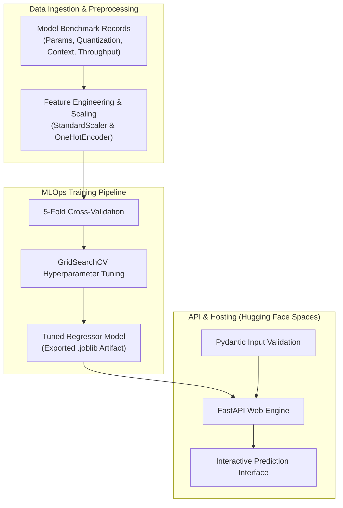

# Enterprise AI Inference Cost Estimator

An end-to-end MLOps predictive pipeline and web application that forecasts fair-market enterprise AI inference costs per million tokens based on model parameters, architectural specifications, and live performance benchmarks.

* **Hugging Face Space:** [huggingface.co/spaces/sajesh-nair-ai/inference-cost-predictor](https://huggingface.co/spaces/sajesh-nair-ai/inference-cost-predictor)
* **Repository:** [github.com/sajesh-nair/inference-cost-predictor](https://github.com/sajesh-nair/inference-cost-predictor)
* **Developer:** Sajesh Nair

---

## Executive Summary

Estimating cloud infrastructure expenses for enterprise Large Language Model (LLM) deployment is often complex due to varying hardware requirements, context lengths, and latency constraints. 

This platform leverages an optimized machine learning pipeline trained on architectural specifications (parameter count, quantization level, context window size) and deployment metrics (throughput, GPU memory usage) to predict fair-market cost per million tokens. The underlying model is tuned using 5-Fold Cross-Validation and GridSearchCV to maintain accurate predictions across both open-weight and proprietary model tiers.

---

## System Architecture & Data Flow

Key Features
Architectural Cost Modeling: Predicts cost per million tokens using structural features such as active parameters, context window, quantization, and required VRAM.

Tuned ML Pipeline: Trained using 5-Fold Cross-Validation and GridSearchCV to minimize prediction error across diverse model families.

Validated FastAPI Service: Features robust input schema validation via Pydantic to ensure reliable API interactions.

Interactive Hugging Face Interface: Serves low-latency inference predictions via a clean web UI hosted directly on Hugging Face Spaces.

Technical Stack
Machine Learning & MLOps: Scikit-Learn, Pandas, NumPy, Joblib

Validation & Tuning: 5-Fold Cross-Validation, GridSearchCV

Backend & API: FastAPI, Pydantic, Uvicorn

Deployment Platform: Hugging Face Spaces (Docker / Streamlit / Gradio)

Local Development Setup
1. Clone the repository
Bash
git clone [https://github.com/sajesh-nair/inference-cost-predictor.git](https://github.com/sajesh-nair/inference-cost-predictor.git)
cd inference-cost-predictor
2. Set up virtual environment
Bash
# Windows
python -m venv env
env\Scripts\activate

# macOS / Linux
python3 -m venv env
source env/bin/activate
3. Install dependencies
Bash
pip install -r requirements.txt
4. Launch the application locally
Bash
uvicorn app.main:app --reload
